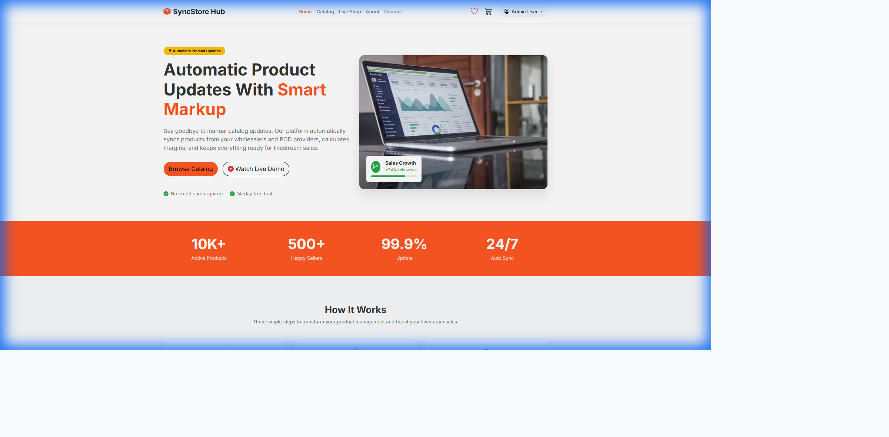



# 🎨 Portfolio CMS
### The Modern Content Management System for Creatives

 

**Portfolio CMS** is a sleek, high-performance platform designed to showcase your work with style and precision. Built on the robust **Laravel** framework and styled with **Tailwind CSS**, it offers a seamless experience for both content creators and visitors.

[Explore Features](#-key-features) • [View Gallery](#-visual-gallery) • [Tech Stack](#-technology-stack) • [Roadmap](#-development-roadmap)

 

---

## 💎 Project Vision

> "Your portfolio is your digital handshake."

We believe that managing your online presence should be as intuitive as creating your art. **Portfolio CMS** strips away the complexity of traditional content management, focusing on speed, aesthetics, and ease of use. It's not just a website; it's a canvas for your professional identity.

---

## 🚀 Key Features

| **⚡ Performance First** | **🎨 Modern Design** | **🛠️ Developer Friendly** |
|:---:|:---:|:---:|
| **Blazing Fast** Optimized with Vite & Laravel | **Tailwind CSS** Beautiful, responsive UI out of the box | **Clean Architecture** MVC pattern for easy scalability |
| **SEO Ready** Built-in best practices for visibility | **Dark Mode** Native support for light and dark themes | **Secure** Enterprise-grade security features |

### 🔍 Deep Dive

#### 👤 For the Creator
*   **Intuitive Dashboard**: Manage your projects, blogs, and profile settings with ease.
*   **Dynamic Content**: updates are reflected instantly across your portfolio.
*   **Customizable**: Easily tweak the design to match your personal brand.

#### 🎬 For the Visitor
*   **Immersive Experience**: Smooth transitions and fast loading times keep visitors engaged.
*   **Responsive**: Looks perfect on desktops, tablets, and mobile devices.

---

## 📸 Visual Gallery

### Landing Page
*The gateway to your creative world.*

---

## 💻 Technology Stack

### 🏗️ Architecture Highlights

*   **Laravel 11**: Utilizing the latest features of the PHP framework for robust backend logic.
*   **Vite**: Next-generation frontend tooling for instant server start and lightning-fast HMR.
*   **Tailwind CSS v4**: Utility-first CSS framework for rapid UI development and consistent design.

---

## 🗺️ Development Roadmap

We are constantly evolving. Here is what's next for Portfolio CMS:

### Phase 1: Foundation (In Progress) 🚧
- [x] Project Setup & Configuration.
- [x] Core Routing & Views.
- [ ] Database Schema Design.
- [ ] Authentication System.

### Phase 2: Core Features
- [ ] Project Management (CRUD).
- [ ] Blog/Article System.
- [ ] Contact Form Integration.
- [ ] Admin Dashboard.

### Phase 3: Polish & Launch
- [ ] SEO Optimization.
- [ ] Performance Tuning.
- [ ] Public Launch.

---

*© 2025 Portfolio CMS. Private Development Project.*
 
*Designed & Engineered with ❤️*

